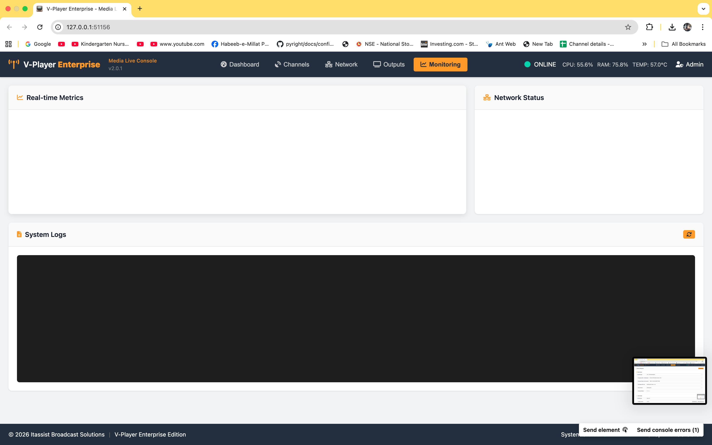

# V-Player - Professional Streaming Solution

A comprehensive Raspberry Pi 3 streaming player with web GUI that supports multiple protocols including SRT, RTMP, UDP, HLS, and RTP with hardware-accelerated video decoding and multiple broadcast output options.

## 🎯 Available Editions

### 🟢 Standard Edition
- **Flask-based architecture**
- **Nginx reverse proxy**
- **Basic authentication**
- **Simple deployment**
- **Lower resource usage**
- **Perfect for small deployments**

### � Enterprise Edition
- **OpenResty + Flask hybrid**
- **Advanced Lua scripting**
- **JWT authentication**
- **Redis caching**
- **Prometheus metrics**
- **Rate limiting**
- **Advanced monitoring**
- **High performance**
- **Enterprise-grade security**
- **Perfect for large deployments**

## 📸 Screenshots

### V-Player Enterprise Dashboard

#### Main Interface


#### Stream Configuration


#### Network Settings


#### Output Configuration


#### System Monitoring


## 📚 Documentation

- **[Usage Documentation](USAGE.md)** - Comprehensive usage guide
- **[Installation Guide](#-quick-start)** - Quick setup instructions
- **[API Reference](USAGE.md#api-reference)** - REST API and WebSocket documentation
- **[Troubleshooting](USAGE.md#troubleshooting)** - Common issues and solutions

## 🚀 Quick Start

### Option 1: Choose Edition (Recommended)
```bash
git clone https://github.com/shihan84/rpiplayer.git
cd rpiplayer
sudo ./deploy/choose-version.sh
```

### Option 2: Standard Edition
```bash
git clone https://github.com/shihan84/rpiplayer.git
cd rpiplayer
sudo ./install-v-player.sh
```

### Option 3: Enterprise Edition
```bash
git clone https://github.com/shihan84/rpiplayer.git
cd rpiplayer
sudo ./enterprise/install-enterprise.sh
```

### Option 4: Pre-built Images
Download from [GitHub Releases](https://github.com/shihan84/rpiplayer/releases)

### Option 1: Pre-built Image (Recommended)
1. Download the latest pre-built image from [Releases](https://github.com/shihan84/rpiplayer/releases)
2. Flash to SD card using Raspberry Pi Imager
3. Boot your Raspberry Pi 3
4. Access web interface at: `http://v-player.local:5000`

### Option 2: Manual Installation

#### Prerequisites
```bash
# Update system
sudo apt update && sudo upgrade -y

# Install dependencies
sudo apt install -y python3 python3-pip nginx ffmpeg git
```

#### Install V-Player
```bash
# Clone repository
git clone https://github.com/shihan84/rpiplayer.git
cd rpiplayer

# Install Python dependencies
pip3 install -r requirements.txt

# Configure video output
sudo ./rpi-image/files/video-output-selector.sh

# Start service
sudo systemctl enable v-player.service
sudo systemctl start v-player.service
```

## Configuration

### Video Output Configuration
```bash
# Interactive configuration menu
sudo /home/rpiplayer/rpi-player/video-output-selector.sh

# Command line configuration
sudo /home/rpiplayer/rpi-player/broadcast-config.sh hdmi
sudo /home/rpiplayer/rpi-player/broadcast-config.sh composite
sudo /home/rpiplayer/rpi-player/broadcast-config.sh auto
```

### Stream Testing
```bash
# Test all protocols
sudo /home/rpiplayer/rpi-player/stream-test.sh all receive

# Test specific protocol
sudo /home/rpiplayer/rpi-player/stream-test.sh srt send
sudo /home/rpiplayer/rpi-player/stream-test.sh rtmp receive
```

## Web Interface Usage

### Starting a Stream
1. Open browser to `http://[RPI-IP]:5000`
2. Enter stream URL (e.g., `srt://192.168.1.100:1234`)
3. Select stream type or use auto-detect
4. Click "Start Stream"

### Supported URL Formats
- **SRT**: `srt://hostname:port`
- **RTMP**: `rtmp://hostname/app/stream`
- **UDP**: `udp://hostname:port`
- **HLS**: `https://hostname/path/stream.m3u8`
- **RTSP**: `rtsp://hostname:port/path`

### System Monitoring
The web interface displays:
- CPU temperature and usage
- Memory usage
- Active streams with status
- Real-time logs
- Stream duration

## Hardware Acceleration

The system automatically detects and uses available hardware acceleration:

### Raspberry Pi 3
- **Video4Linux2**: H.264/H.265 encoding/decoding
- **MMAL**: Broadcom multimedia acceleration
- **GPU**: OpenGL ES acceleration

### Performance Optimization
```bash
# Optimize for streaming
sudo /home/rpiplayer/rpi-player/broadcast-config.sh hdmi

# Set GPU memory
echo 'gpu_mem=256' | sudo tee -a /boot/config.txt

# Enable performance governor
echo 'GOVERNOR="performance"' | sudo tee /etc/default/cpufrequtils
```

## Broadcast Scenarios

### Professional Broadcasting
```bash
# HDMI output with high quality
sudo /home/rpiplayer/rpi-player/broadcast-config.sh hdmi

# Configure for 1080p output
sudo /home/rpiplayer/rpi-player/video-output-selector.sh
# Select option 4 (1920x1080)
```

### Mobile Broadcasting
```bash
# Composite output for legacy equipment
sudo /home/rpiplayer/rpi-player/broadcast-config.sh composite

# Low power mode
echo 'arm_freq=900' | sudo tee -a /boot/config.txt
```

### Multi-Display Setup
```bash
# Auto-detect best output
sudo /home/rpiplayer/rpi-player/broadcast-config.sh auto

# Enable all outputs
echo 'hdmi_force_hotplug=1' | sudo tee -a /boot/config.txt
echo 'enable_tvout=1' | sudo tee -a /boot/config.txt
```

## API Reference

### REST API Endpoints

#### Start Stream
```http
POST /api/start_stream
Content-Type: application/json

{
    "url": "srt://192.168.1.100:1234",
    "type": "srt"
}
```

#### Stop Stream
```http
POST /api/stop_stream
Content-Type: application/json

{
    "stream_id": "abc12345"
}
```

#### Get Stream Status
```http
GET /api/stream_status/{stream_id}
```

#### Get All Streams
```http
GET /api/all_streams
```

#### System Information
```http
GET /api/system_info
```

### WebSocket Events

#### Client to Server
- `get_streams` - Request streams list
- `get_system_info` - Request system information

#### Server to Client
- `streams_update` - Streams status update
- `stream_started` - New stream started
- `stream_stopped` - Stream stopped
- `system_info` - System information update
- `error` - Error notification

## Troubleshooting

### Common Issues

#### Stream Won't Start
```bash
# Check FFmpeg installation
ffmpeg -version

# Test stream manually
ffmpeg -i "srt://example.com:1234" -f null -

# Check logs
sudo journalctl -u v-player.service -f
```

#### No Video Output
```bash
# Check video configuration
cat /boot/config.txt | grep -E "(hdmi|gpu_mem|dtoverlay)"

# Test video output
ffmpeg -f lavfi -i testsrc -t 10 -f fbdev /dev/fb0

# Reconfigure video output
sudo /home/rpiplayer/rpi-player/video-output-selector.sh
```

#### High CPU Usage
```bash
# Check hardware acceleration
ffmpeg -encoders | grep h264

# Enable GPU acceleration
echo 'dtoverlay=vc4-kms-v3d' | sudo tee -a /boot/config.txt

# Reboot
sudo reboot
```

### Log Files
- **Application logs**: `/home/rpiplayer/rpi-player/logs/vplayer.log`
- **System logs**: `sudo journalctl -u v-player.service`
- **FFmpeg logs**: Stream-specific logs in `/tmp/`

### Performance Tuning
```bash
# Monitor system resources
htop
vcgencmd get_throttled

# Optimize memory
echo 'gpu_mem=256' | sudo tee -a /boot/config.txt

# Set CPU governor
echo 'GOVERNOR="performance"' | sudo tee /etc/default/cpufrequtils
sudo systemctl restart cpufrequtils
```

## Building Custom Images

### GitHub Actions
The project includes automated GitHub Actions for building custom Raspberry Pi images:

1. Push to `main` branch to trigger build
2. Download generated image from Actions tab
3. Flash image to SD card
4. Boot your Raspberry Pi 3
5. Access web interface at: `http://v-player.local:5000`

### Manual Build
```bash
# Clone pi-gen
git clone https://github.com/RPi-Distro/pi-gen.git
cd pi-gen

# Copy V-Player stage
cp -r ../rpi-player/rpi-image stage-v-player

# Build image
sudo ./build.sh
```

## Development

### Local Development
```bash
# Create virtual environment
python3 -m venv venv
source venv/bin/activate

# Install dependencies
pip install -r requirements.txt

# Start development server
python app.py
```

### Project Structure
```
v-player/
├── app.py                 # Main Flask application
├── config.py             # Configuration settings
├── stream_decoder.py     # FFmpeg stream management
├── network_monitor.py     # Network monitoring
├── requirements.txt      # Python dependencies
├── templates/            # HTML templates
├── static/              # CSS, JavaScript, images
├── rpi-image/           # Image build scripts
│   ├── 00-v-player-config
│   ├── 01-ffmpeg-build
│   ├── 02-network-config
│   ├── 03-splash-config
│   └── files/          # Configuration files
└── README.md           # This file
```

## License

This project is licensed under the MIT License - see the [LICENSE](LICENSE) file for details.

Copyright © 2026 ITAssist Broadcast Solutions. All rights reserved.

## Support

- **Documentation**: [USAGE.md](USAGE.md) - Comprehensive usage guide
- **Issues**: [GitHub Issues](https://github.com/shihan84/rpiplayer/issues)
- **Discussions**: [GitHub Discussions](https://github.com/shihan84/rpiplayer/discussions)
- **Wiki**: [Project Wiki](https://github.com/shihan84/rpiplayer/wiki)
- **Email**: support@itassistbroadcast.com

## About V-Player

V-Player is a professional streaming solution developed by **ITAssist Broadcast Solutions**, designed specifically for Raspberry Pi hardware. It provides enterprise-grade streaming capabilities with a modern web interface, making it ideal for professional broadcasting applications.

### Key Features:
- **Professional Branding**: Clean, modern interface with V-Player branding
- **Hardware Optimized**: Specifically tuned for Raspberry Pi performance
- **Broadcast Ready**: Multiple output options for professional use
- **Network Management**: Comprehensive network configuration and monitoring
- **Easy Deployment**: Automated image building and installation
- **Enterprise Security**: Cloudflare Zero Trust integration
- **Professional Support**: Commercial support available

### ITAssist Broadcast Solutions
ITAssist Broadcast Solutions is a leading provider of professional broadcasting and streaming solutions, specializing in:
- Hardware-optimized media players
- Network management systems
- Enterprise streaming solutions
- Professional broadcasting equipment
- Technical support and consulting

**Website**: https://itassistbroadcast.com  
**Email**: support@itassistbroadcast.com  
**Phone**: +1-555-VPLAYER (8752937)

---

**V-Player Enterprise - Professional Streaming Solution**  
**Copyright © 2026 ITAssist Broadcast Solutions**
